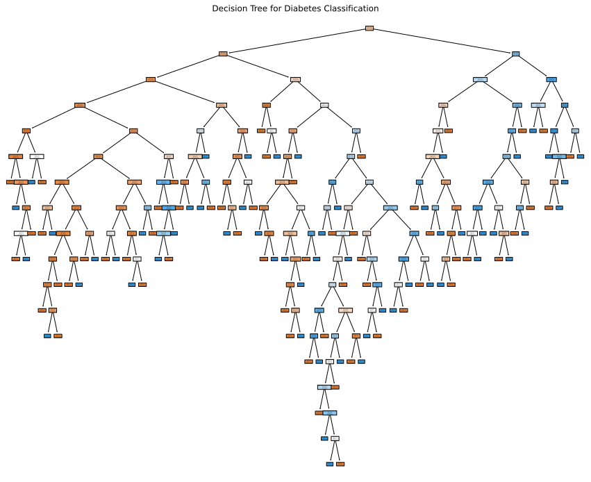
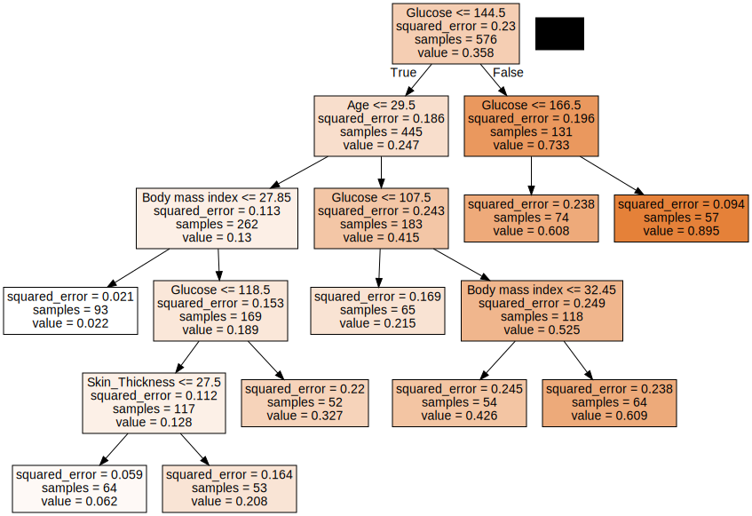

</head>
<body style="font-family: Arial, sans-serif; line-height: 1.6; max-width: 800px; margin: 0 auto; padding: 20px;">

  <h1>🧠 Diabetes Prediction using Decision Trees</h1>

  
This project uses a Decision Tree Classifier to predict whether an individual has diabetes based on various medical attributes. The focus is on building an interpretable model and understanding its decisions — both before and after pruning.

  <h2>📌 Problem Statement</h2>
  
The goal is to train a Decision Tree model that accurately predicts diabetes using health-related features. We aim to improve both accuracy and model interpretability by visualizing and pruning the decision tree.

  <h2>📊 Dataset Overview</h2>
  <ul>
    <li>Number of pregnancies</li>
    <li>Plasma glucose concentration</li>
    <li>Diastolic blood pressure</li>
    <li>Skinfold thickness</li>
    <li>2-Hour serum insulin</li>
    <li>Body Mass Index (BMI)</li>
    <li>Diabetes Pedigree Function</li>
    <li>Age</li>
    <li>Outcome (Yes/No)</li>
  </ul>

  <h2>🧹 Data Preprocessing</h2>
  <ul>
    <li>Handled missing values appropriately.</li>
    <li>Encoded the outcome variable to binary format (0 for No, 1 for Yes).</li>
    <li>Detected and treated outliers using statistical methods like Z-scores and box plots.</li>
  </ul>

  <h2>🔍 Exploratory Data Analysis (EDA)</h2>
  <ul>
    <li>Univariate analysis through histograms and boxplots.</li>
    <li>Bivariate analysis comparing features against the diabetes outcome.</li>
    <li>Correlation heatmap to study feature relationships.</li>
  </ul>

  <h2>🌲 Model Building & Evaluation</h2>
  <ul>
    <li>Trained using a Decision Tree Classifier with a 75-25 train-test split.</li>
    <li>Evaluated using accuracy, precision, recall, and confusion matrix.</li>
    <li>Performed post-pruning to simplify the model and reduce overfitting.</li>
  </ul>

  <h2>🖼️ Visualizations</h2>

  
<strong>Before Pruning:</strong>

  

  
<strong>After Pruning:</strong>

  

  <h2>🛠️ Tech Stack</h2>
  <ul>
    <li>Python (Google Colab)</li>
    <li>sklearn</li>
    <li>pandas, numpy</li>
    <li>matplotlib, seaborn</li>
  </ul>

  <h2>📂 Files Included</h2>
  <ul>
    <li><strong>Decision_Trees_Diabetes.ipynb</strong>: Full Colab notebook with code.</li>
    <li><strong>Diabetes.csv</strong>: Dataset in csv format.</li>
    <li><strong>diabetes_tree.svg</strong>: Raw decision tree visualization.</li>
    <li><strong>regression_tree.svg</strong>: Tree after applying pruning.</li>
  </ul>

  <h2>🙋‍♂️ Author</h2>
  
Crafted by <strong>Siddharth Jain</strong>

  

    🔗 <a href="https://www.linkedin.com/in/siddharth-jain-8b56a2321/" target="_blank">Connect with me on LinkedIn</a>
  

</body>
</html>
